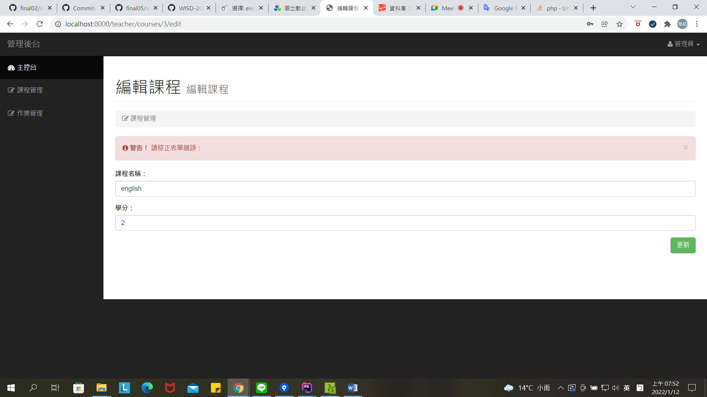

## 課程管理

## 編輯課程

## 新增課程

## ERD

## 資料庫綱要圖

## 資料庫欄位設計
使用者資料表

學生資料表

老師資料表

修習資料表

課程資料表

作業資料表

繳交資料表

## 系統主要功能
老師：可新增、刪除、修改課程資料

## 網站安裝(系統恢復步驟)
1. 複製 https://github.com/WISD-2021/final03.git 本系統在GitHub的專案
- **打開 Source tree，點選 Clone 後，輸入以下資料Source Path:https://github.com/WISD-2021/final03.git Destination Path:C:\wagon\uwamp\www\final03 打開cmder，切換至專案所在資料夾，cd final03**

2. 在cmder輸入以下命令，以復原此系統：
- **composer install**
- **composer run‐script post‐root‐package‐install**
- **composer run‐script post‐create‐project‐cmd**

3. 將專案打開 在.env檔案內輸入資料庫主機IP、Port、名稱、與帳密如下：：
- **DB_HOST=127.0.0.1**
- **DB_PORT=33060**
- **DB_DATABASE=final03**
- **DB_USERNAME=root**
- **DB_PASSWORD=root**

4. 復原完，建立資料庫
- **先進Adminer建立final03的資料庫**
- **建立好之後開啟cmder輸入以下指令： artisan migrate(成功執行後會復原所有資料表)**
- **artisan db:seed(建立假資料)**

5. 進入adminer
- **資料庫系統:MYSQL**
- **伺服器:localhost:33060**
- **帳號:root**
- **密碼:root**

6. 在UwAmp下，點選Apache config，選擇port 8000 ，並在Document Root 輸入{DOCUMENTPATH}/final03/public

## 初始專案與DB負責的同學
* 初級專案建置：[3A832060 張雅茹](http://github.com/3A832060)
* 資料庫關聯：[3A832060 張雅茹](http://github.com/3A832060)
* 資料庫資料建置：[3A832060 張雅茹](http://github.com/3A832060)

## 系統使用帳號(使用者資料)
* 前台-學生 帳號：3a832060@gmail.com  密碼：3a832060
* 後台-教師 帳號：three@gmail.com 密碼：three333

## 系統測試資料存放位置
* final03底下的sql資料夾

## 系統開發人員
* [3A832060 張雅茹](http://github.com/3A832060)

## 工作分配
前台：[3A832060 張雅茹](http://github.com/3A832060)

後台：[3A832060 張雅茹](http://github.com/3A832060)
* Route::prefix('teacher')->group(function () {
* //主控台
* Route::get('/', [\App\Http\Controllers\TeacherController::class, 'index'])->name('teacher.dashboard.index');
* //課程管理頁面
* Route::get('courses', [\App\Http\Controllers\CourseController::class, 'index'])->name('teacher.courses.index');
* //新增課程
* Route::get('courses/create', [\App\Http\Controllers\CourseController::class, 'create'])->name('teacher.courses.create');
* //編輯課程
* Route::get('courses/{id}/edit', [\App\Http\Controllers\CourseController::class, 'edit'])->name('teacher.courses.edit');
* //儲存課程
* Route::post('courses',[\App\Http\Controllers\CourseController::class,'store'])->name('teacher.courses.store');
* //更新課程
* Route::patch('courses/{id}',[\App\Http\Controllers\CourseController::class,'update'])->name('teacher.courses.update'); 
* //刪除課程
* Route::get('courses/{id}',[\App\Http\Controllers\CourseController::class,'delete'])->name('teacher.courses.destroy');

* //作業管理頁面
* Route::get('homeworks', [\App\Http\Controllers\HomeworkController::class, 'index'])->name('teacher.homeworks.index');
* //新增作業
* Route::get('homeworks/create', [\App\Http\Controllers\HomeworkController::class, 'create'])->name('teacher.homeworks.create');
* //編輯作業
* Route::get('homeworks/{id}/edit', [\App\Http\Controllers\HomeworkController::class, 'edit'])->name('teacher.homeworks.edit');
* //儲存作業
* Route::post('homeworks',[\App\Http\Controllers\HomeworkController::class,'store'])->name('teacher.homeworks.store');
* //更新作業
* Route::patch('homeworks/{id}',[\App\Http\Controllers\HomeworkController::class,'update'])->name('teacher.homeworks.update');
* //刪除作業
* Route::get('homeworks/{id}',[\App\Http\Controllers\HomeworkController::class,'delete'])->name('teacher.homeworks.destroy');
* });
